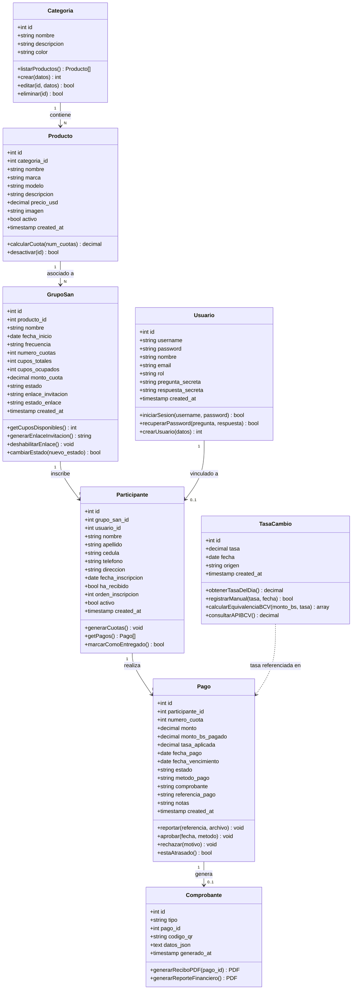
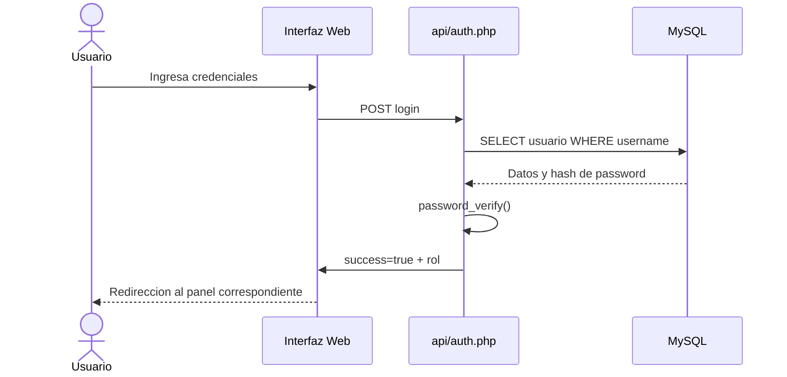
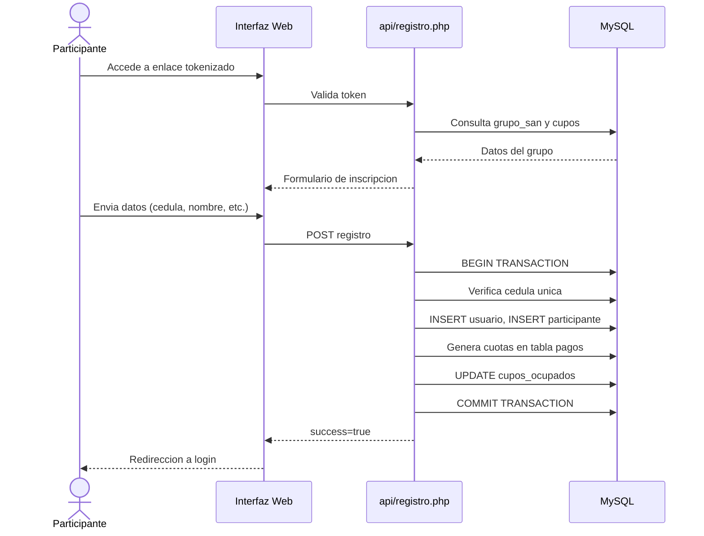
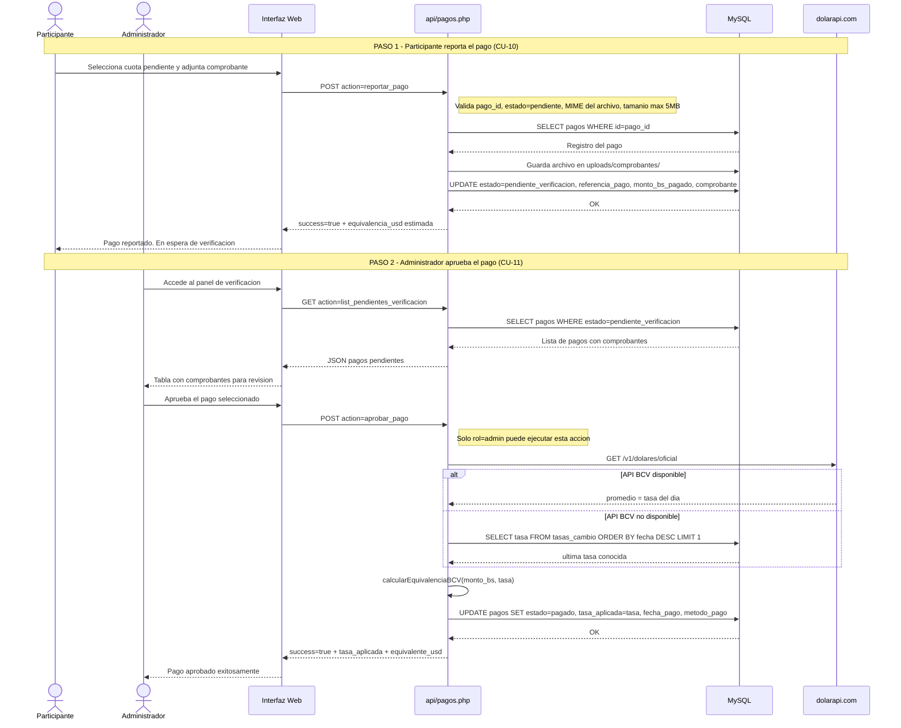
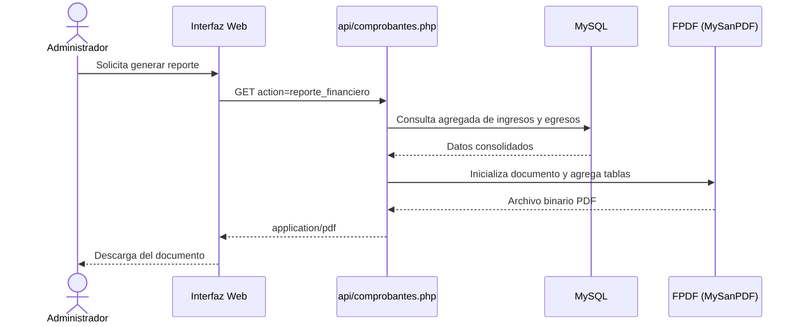
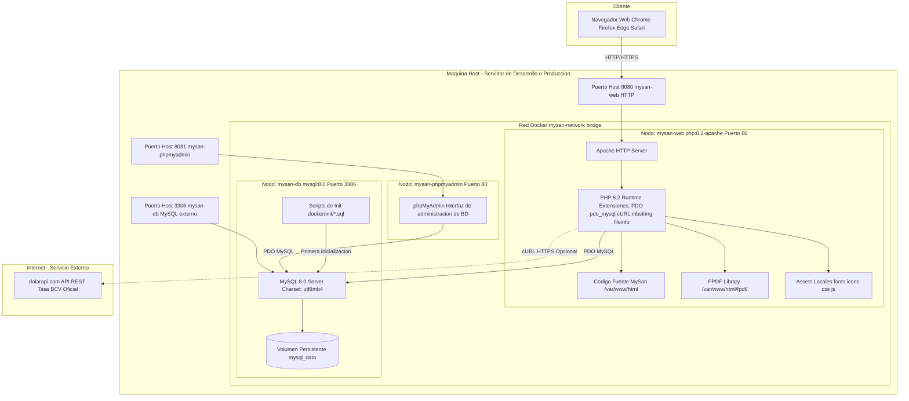
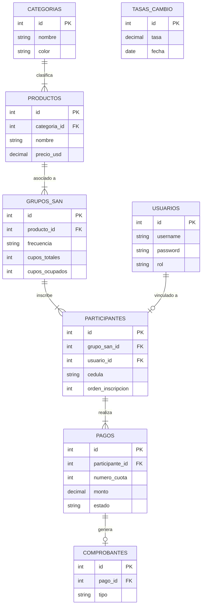

# REPÚBLICA BOLIVARIANA DE VENEZUELA
# UNIVERSIDAD NACIONAL EXPERIMENTAL DE LOS LLANOS CENTRALES
# RÓMULO GALLEGOS
# INGENIERÍA EN INFORMÁTICA
# AULA TERRITORIAL ORTIZ
# ESTADO GUÁRICO

**Sistema de información para el monitoreo de créditos individuales y control de cuotas en la venta de equipos y financiamientos de motos.**

Proyecto de trabajo especial de Grado para optar el título de ingeniero en informática

**Autor:** 
Fernández Leivis  
C.I. V.- 21.337.676

**Tutor Asesor:**
Ing. Iraimar Gutiérrez

**Tutor Académico:** 
Ing. Yuriz García
C.I. V.- 19.724.126

Ortiz, mayo de 2026

---

**RESUMEN**

El desarrollo del mundo digital siguió transformando la vida cotidiana y laboral, proporcionando herramientas que incrementaron la eficiencia en diversas áreas, incluyendo la financiera. Los sistemas de información, con sus bases de datos estructuradas, fueron valorados por su rapidez, seguridad y precisión para resolver problemas. Por ello, se desarrolló un Sistema de Información para el monitoreo de créditos individuales y el control de cuotas en la venta de equipos y financiamiento de motos. Esta solución permitió gestionar el registro de clientes, historial de pagos, control de cuotas y cálculo automático de manera integrada. Para su construcción, se empleó la metodología RUP, asegurando el cumplimiento de los requerimientos de gestión financiera. La implementación técnica utilizó JavaScript, HTML y PHP, con MySQL como gestor de base de datos y WampServer como entorno de servidor, manteniendo un enfoque robusto y eficiente.

**Palabras claves:** sistema, financiera, monitoreo, tecnologías.

---

**ABSTRACT**

The development of the digital world continued to transform daily and professional life, providing tools that increased efficiency in various areas, including finance. Information systems, with their structured databases, were valued for their speed, security, and precision in solving problems. Therefore, an Information System was developed for monitoring individual credits and controlling installments in the sale of equipment and motorcycle financing. This solution enabled the integrated management of client registration, payment history, installment control, and automatic calculation. For its construction, the RUP methodology was used, ensuring compliance with financial management requirements. The technical implementation utilized JavaScript, HTML, and PHP, with MySQL as the database management system and WampServer as the server environment, maintaining a robust and efficient approach.

**Keywords:** system, finance, monitoring, technologies.

---

**DIAGNÓSTICO SITUACIONAL**

**Planteamiento del Problema**

La digitalización de los procesos financieros y crediticios se ha convertido en un factor determinante para la eficiencia y competitividad de las organizaciones. Específicamente, la gestión de carteras de crédito para la venta de bienes específicos, como electrodomésticos y motocicletas, enfrentaba desafíos significativos cuando se realizaba de manera manual o mediante herramientas digitales genéricas. De hecho, este tipo de financiamiento, que involucraba un ciclo constante de ingresos de participantes, pagos de cuotas y liberación de créditos, requería un seguimiento meticuloso, cálculos precisos y una trazabilidad completa.

Por consiguiente, la falta de sistemas especializados conducía a errores en el cálculo de intereses y moras, retrasos en la actualización de estados de cuenta y una gestión ineficiente del historial crediticio de los clientes. Además, un análisis de Herrera sobre "[1] Tecnología Aplicada a Financiamientos" señalaba que la ausencia de un módulo integrado para el control de participantes generaba cuellos de botella operativos, dificultaba la asignación transparente de recursos y aumentaba el riesgo de incumplimiento debido a la falta de recordatorios automatizados y seguimiento en tiempo real. Esta idea fue apoyada por investigaciones recientes; por ejemplo, Cordero y Rojas destacaron que "[2] la automatización de procesos crediticios no es solo una ventaja competitiva, sino un requisito para la supervivencia financiera en mercados con alta demanda de activos” (p. 45). De manera similar, un estudio de Mendoza concluyó que “[3] la centralización de datos en sistemas de información redujo en un 70% los errores de cálculo y mejoró la trazabilidad de las operaciones financieras” (p. 112).

En el contexto de las empresas dedicadas a la venta y financiamiento de bienes bajo este método, estos problemas se traducían en:

Pérdida de información y falta de centralización: Los registros de participantes, contratos y pagos solían estar dispersos en planillas de cálculo y archivos físicos, dificultando el acceso rápido y fiable a la información. Sobre este punto, Pérez indicó que esta fragmentación “[4] incrementó el riesgo operacional y los costos de auditoría, al carecer de un único punto de verificación de la verdad crediticia” (p. 28).

Cálculos manuales propensos a errores: La determinación manual de cuotas, intereses, saldos y el momento exacto de asignación de un participante era un proceso lento y con alta probabilidad de inexactitudes y errores, lo que afectaba la confianza del participante y la salud financiera de la empresa.

Falta de monitoreo y alertas proactivas: No contar con un sistema que notificara automáticamente los pagos próximos a vencer, los morosos o los participantes elegibles para recibir financiamiento, resultó en una gestión reactiva, cobranzas ineficientes y oportunidades perdidas. En relación con esto, Silva advirtió que “[5] la falta de mecanismos automatizados de alerta fue el principal factor de deterioro de carteras de bajo monto, al posponer la acción de recuperación” (p. 77).

Dificultad para la generación de indicadores: La toma de decisiones estratégicas se vio obstaculizada por la incapacidad de generar reportes consolidados y métricas en tiempo real sobre la cartera crediticia, el comportamiento de pago y la rentabilidad del esquema de financiamiento. Finalmente, esta limitación, como señaló el análisis de Herrera [1], impidió una evaluación ágil del desempeño del modelo de negocio.

Ante esta situación, surgió la siguiente pregunta de investigación que este proyecto buscó responder: ¿Cómo el desarrollo e implementación de un Sistema de Información especializado optimizó la gestión del monitoreo de créditos individuales y el control de cuotas en un esquema de financiamiento para la venta de bienes como equipos electrodomésticos y motocicletas, mejorando la precisión, seguridad y eficiencia operativa en comparación con los métodos manuales o semiautomatizados actuales?

**Justificación**

La implementación del Sistema de Información para el Monitoreo de Créditos Individuales y Control de Cuotas se justificó en tres dimensiones principales: práctica, tecnológica y social. Además, estas dimensiones convergieron para responder a las necesidades actuales de gestión financiera en un entorno digitalizado, optimizando procesos y generando valor tanto operativo como comunitario.

* Justificación Práctica: Centralizó y automatizó el registro de clientes, historial de pagos y control de cuotas. Eliminó errores, pérdida de información y lentitud de los métodos manuales. Agilizó la toma de decisiones y optimizó la gestión de participantes en financiamientos.
* Justificación Tecnológica: Utilizó la metodología RUP para un desarrollo estructurado, escalable y mantenible. Aprovechó ventajas digitales: integridad de datos, procesamiento en tiempo real y reportes automáticos. Modernizó la infraestructura y preparó la organización para futuras integraciones.
* Justificación Social: Promovió transparencia y confianza al dar a los clientes claridad sobre sus compromisos financieros. Garantizó equidad en modelos de financiamiento, fomentando inclusión financiera. Fortaleció la reputación de la organización mediante una gestión responsable.

Este sistema fue una solución integral que optimizó la gestión operativa, implementó tecnología robusta y contribuyó a una relación más transparente con la comunidad.

**Objetivos del Proyecto**

1. **Objetivo general**
Implementar un Sistema de información para el monitoreo de créditos individuales y control de cuotas en la venta de equipos y financiamientos de motos.

2. **Objetivos específicos:**
* Definir los requerimientos funcionales y técnicos del sistema, considerando las variables críticas del financiamiento de motos (intereses, plazos, morosidad) y las necesidades de reporte.
* Diseñar la arquitectura del software y la base de datos, garantizando la integridad, y seguridad de la información de cada cliente y sus respectivas cuotas.
* Desarrollar los módulos de gestión de perfiles de clientes, cronogramas de pagos automatizados y alertas tempranas de mora para facilitar la toma de decisiones preventivas.

**Procesos automatizados**

El sistema digitalizó y automatizó un total de ocho procesos fundamentales que anteriormente se gestionaban de forma manual, eliminando errores, aumentando la transparencia y garantizando la trazabilidad operativa y financiera de los grupos de ahorro.

En la gestión de participantes, se sustituyó el registro en cuadernos y el envío manual de invitaciones por procesos estructurados. La inscripción de nuevos participantes se realizó a través de un formulario en línea que validó datos y almacenó la información de forma segura. Además, el sistema facilitó la incorporación de nuevos participantes mediante la generación de un enlace de invitación único y seguro que permitió la auto-inscripción de los mismos.

Respecto al control financiero y de pagos, la administración se volvió precisa y transparente. El seguimiento de las cuotas, que antes se hacía con listas escritas, se visualizó en un panel que mostraba el estado de pago de cada miembro en tiempo real (pendiente, en verificación, pagado o atrasado). El cálculo del monto de la cuota se realizó de manera automática, dividiendo el valor total del producto entre el número de cuotas acordadas. La complejidad de la doble moneda (bolívares y dólares) se resolvió con la obtención automática de la tasa oficial del Banco Central de Venezuela (BCV), permitiendo la conversión precisa de las transacciones. Finalmente, la verificación de los pagos reportados se formalizó mediante un flujo de aprobación que requirió que el administrador revisara y validara un comprobante digital cargado por el participante.

En el área de operaciones y documentación, se eliminaron las prácticas informales. La asignación de entregas, que se hacía con papelitos, se realizó electrónicamente por el orden en que se registró un participante a un grupo san, e incluyó el ajuste automático de las fechas de entrega del fondo para cada asignación. La ausencia de documentación formal se subsanó con la generación inmediata de documentos digitales oficiales, tales como recibos de pago y reportes financieros consolidados.

**Determinación, Instalación y Configuración de las herramientas de desarrollo**

**Plataformas de desarrollo**

El desarrollo del sistema se sustentó en una combinación de recursos de hardware y una pila tecnológica de software de código abierto, seleccionados estratégicamente para garantizar la estabilidad, la máxima portabilidad y el costo de licenciamiento nulo.

Para la construcción y las pruebas de la aplicación, se determinaron los siguientes recursos clave:
* **Hardware:** Se utilizó una computadora DELL LATITUDE 7480, equipada con un procesador Intel Core i7 de 7ma generación, 16GB de memoria RAM y un disco sólido (SSD) de 256GB.
* **Editor de Código:** Se seleccionó Visual Studio Code (VS Code), reconocido por su ligereza, versatilidad y por ser un editor estándar de la industria, disponible sin costo.
* **Navegadores de Prueba:** Las validaciones de compatibilidad y funcionalidad de la interfaz web se realizaron en los principales navegadores del mercado: Google Chrome, Microsoft Edge y Firefox.

En cuanto a la pila tecnológica, el sistema fue desarrollado íntegramente sobre tecnologías de código abierto, elegidas por su madurez, estabilidad y amplia documentación:
* **Servidor y Backend:** Se utilizó PHP 7.4 / 8.0 (Vanilla) como lenguaje de scripting del lado del servidor, sin dependencia de frameworks para maximizar la portabilidad. El servidor web fue Apache HTTP Server, orquestado mediante la imagen oficial php:8.2-apache a través de Docker Hub.
* **Base de Datos:** El sistema se apoyó en MySQL 5.7 / 8.0 como gestor de base de datos relacional. Se configuró el motor de almacenamiento InnoDB para garantizar el soporte de transacciones ACID y la integridad referencial. La capa de abstracción PDO (PHP Data Objects) fue fundamental para el acceso seguro a la BD, utilizando sentencias preparadas que previenen la inyección SQL.
* **Frontend y Diseño:** La interfaz de usuario se construyó con HTML5, CSS3 Vanilla y JavaScript ES6+, prescindiendo de frameworks de frontend para eliminar dependencias de CDN externos y asegurar la operatividad en entornos con conectividad limitada.
* **Librerías y Orquestación:** Se integraron librerías específicas como FPDF 1.86 para la generación nativa de documentos PDF (recibos y reportes). El desarrollo se gestionó con Docker + Docker Compose, que orquestó los tres servicios principales (mysan-web, mysan-db y phpMyAdmin), y el control de versiones distribuido se mantuvo con Git.
* **Recursos Estáticos:** El diseño se complementó con Feather Icons (servido como sprite SVG local) y la tipografía Inter Font (servida desde assets/fonts/), garantizando que todos los activos estáticos estuvieran disponibles localmente.

**Arquitectura del Sistema de Información**

El sistema fue desarrollado bajo el modelo cliente-servidor de tres capas, una arquitectura que definió una clara separación de responsabilidades para optimizar la escalabilidad, el mantenimiento y la gestión de riesgos. Esta estructura lógica organizó el sistema en tres subsistemas distintos que se comunicaban de manera secuencial:

1. **Capa de Presentación (Cliente)**
Esta capa fue la interfaz de usuario, ejecutada íntegramente en el navegador web del cliente. Su objetivo principal fue la interacción y visualización de la información, adoptando el paradigma de diseño **Bento Grid**. No contuvo ninguna regla de negocio; en su lugar, consumió los puntos finales de la Capa de Lógica de Negocio mediante solicitudes asíncronas para presentar datos y capturar las acciones del usuario. La construcción del frontend se realizó sin dependencias de frameworks externos, asegurando su operatividad en entornos con conectividad limitada.

2. **Capa de Lógica de Negocio (Servidor)**
Ubicada en el servidor web, esta capa actuó como el núcleo funcional del sistema, centralizando todas las reglas de negocio, la lógica de procesamiento de datos y las políticas de seguridad. Fue responsable de recibir las peticiones de la Capa de Presentación, realizar la validación de los datos y gestionar los flujos operativos clave, como el módulo financiero multimoneda, el flujo de aprobación de pagos y la generación de documentos PDF. El acceso a la Capa de Datos se realizó de forma segura mediante sentencias preparadas a través de la capa de abstracción PDO.

3. **Capa de Datos (Base de Datos)**
Esta capa gestionó el almacenamiento persistente de toda la información. El sistema utilizó un gestor de base de datos relacional configurado con el motor InnoDB. Este motor fue seleccionado específicamente para garantizar el soporte de transacciones ACID y la integridad referencial entre las entidades del dominio (usuarios, grupos, pagos, participantes, etc.).

4. **Dependencia de Servicios de terceros**
La arquitectura integró una dependencia crítica con la API de dolarapi.com. Este servicio fue consultado por la Capa de Lógica de Negocio para obtener automáticamente la tasa oficial del Banco Central de Venezuela (BCV), esencial para la conversión precisa y la trazabilidad histórica de los pagos multimoneda. El sistema fue diseñado para usar un modo degradado, utilizando la última tasa local, en caso de que la API externa no estuviera disponible.

**Selección del Entorno del Sistema de Información**

1. **Entorno de desarrollo**
Este entorno se basó en la pila tecnológica seleccionada (PHP, MySQL, Apache) y utilizó la contenerización Docker para asegurar la portabilidad y replicabilidad de la arquitectura, garantizando un entorno de pruebas y despliegue consistente.
* Plataforma Local: Windows 11 con Docker Desktop.
* Orquestación: Docker Compose, que desplegó los tres servicios (Web, Base de Datos y phpMyAdmin) sobre la red interna mysan-network.
* Acceso a la aplicación: http://localhost:8080
* Administración de BD: phpMyAdmin en http://localhost:8081

2. **Entorno de producción**
El entorno de producción fue diseñado sobre una infraestructura de servidor Linux/LAMP para garantizar la estabilidad operativa. El despliegue final se realizó sobre un VPS con la pila tecnológica LAMP, y el uso de los contenedores Docker fue el método preferido para asegurar la consistencia y portabilidad del sistema.
* **Pila tecnológica en Servidor:** Servidor Linux con Apache 2.4 y PHP 7.4+ (requirió extensiones PDO, cURL, mbstring y fileinfo).
* **Base de Datos:** MySQL 5.7 o superior, configurado con motor InnoDB.
* **Seguridad:** Uso obligatorio de HTTPS mediante certificado SSL/TLS (Let's Encrypt).
* **Configuración:** Zona horaria configurada en America/Caracas.

3. **Variables de entorno**
Las variables de entorno se utilizaron para desacoplar la configuración sensible del código fuente, facilitando la portabilidad entre entornos.

| Variable | Valor por defecto (Docker) | Descripción del Valor |
| ----- | ----- | ----- |
| DB\_HOST | db | Nombre de host o IP del servidor de base de datos. |
| DB\_NAME | mysan | Nombre de la base de datos a la que la aplicación se conectará. |
| DB\_USER | mysan\_user | Nombre de usuario de MySQL con permisos sobre la base de datos. |
| DB\_PASS | mysan\_password | Contraseña del usuario de la base de datos. |
| DB\_CHARSET | utf8mb4 | Codificación de caracteres de la conexión. |

**Metodología para el Desarrollo del Sistema de Información**

Para el desarrollo del sistema se adoptó el Proceso Unificado Racional (RUP), una metodología de desarrollo de software de carácter iterativo e incremental, basada en casos de uso, centrada en la arquitectura y orientada a la gestión de riesgos.

RUP organizó el ciclo de vida del proyecto en cuatro fases secuenciales:

1. **Fase 1: Inicio (Inception)**
El propósito fue establecer el caso de negocio y delimitar el alcance del proyecto. Se definió la visión del producto, se identificaron los actores principales y se evaluaron los riesgos iniciales.

2. **Fase 2: Elaboración (Elaboration)**
El objetivo fue analizar el dominio del problema, establecer una arquitectura estable y mitigar los riesgos de mayor impacto. Se levantó el modelo de casos de uso completo, se definió la arquitectura de tres capas, y se produjeron los modelos UML y el diseño de la base de datos.

3. **Fase 3 — Construcción (Construction)**
El propósito fue construir el producto de software completo. Se desarrollaron sucesivas iteraciones funcionales en las que se implementó el código fuente.

4. **Fase 4 — Transición (Transition)**
El propósito fue transferir el sistema a los usuarios finales y garantizar que el producto estaba listo para su operación en producción. Incluyó pruebas y despliegue.

**Desarrollo de Sistema**

**Fase de planificación**

1. **Descripción**
En el marco de RUP, la fase de planificación correspondió a las actividades desarrolladas durante la Fase de Inicio y la primera iteración de la Fase de Elaboración. Se levantó el modelo de negocio, se identificaron los actores del sistema y se documentaron los casos de uso.
Se determinó que el sistema debía soportar dos actores principales: el Administrador y el Participante. Adicionalmente, el Sistema BCV.

2. **Requerimientos funcionales**

| ID | Caso de Uso Origen | Descripción del Requerimiento |
| :---- | :---- | :---- |
| RF-01 | CU-01 Autenticar Usuario | Inicio de sesión con usuario y contraseña validada mediante hash bcrypt. |
| RF-02 | CU-01 Autenticar Usuario | Redirección según rol, dirigiendo al Administrador y al Participante a sus respectivos paneles. |
| RF-03 | CU-02 Recuperar Contraseña | Recuperación de acceso mediante pregunta y respuesta secreta. |
| RF-04 | CU-03 Gestionar Usuarios | El Administrador pudo crear nuevos usuarios del sistema. |
| RF-05 | CU-04 Gestionar Categorías | CRUD completo de categorías. |
| RF-06 | CU-05 Gestionar Productos | Catálogo con nombre, marca, modelo, precio USD, imagen y estado activo/inactivo. |
| RF-07 | CU-06 Crear Grupo San | Crear grupos vinculados a un producto con nombre, fecha inicio, frecuencia, cuotas y cupos. |
| RF-08 | CU-06 Crear Grupo San | Cálculo automático del monto de cuota. |
| RF-09 | CU-07 Gestionar Estado Grupo | Ciclo de vida gestionado: abierto, en\_curso, finalizado. |
| RF-10 | CU-08 Generar Enlace Invitación | Enlace tokenizado para auto-inscripción de participantes. |
| RF-11 | CU-09 Inscribir Participante | Registro con nombre, apellido, cédula, teléfono, dirección y fecha de inscripción. |
| RF-12 | CU-09 Inscribir Participante | Cédula de identidad única en el sistema. |
| RF-13 | CU-09 Inscribir Participante | Generación automática de cuotas al inscribir participante. |
| RF-14 | CU-10 Reportar Pago | Participante reportó pago adjuntando comprobante y referencia bancaria. |
| RF-15 | CU-11 Aprobar/Rechazar Pago | Administrador aprobó o rechazó los pagos reportados. |
| RF-16 | CU-11 Aprobar/Rechazar Pago | Al aprobar, se registró la tasa BCV y se calculó equivalencia USD/VES. |
| RF-17 | CU-12 Obtener Tasa BCV | Obtención automática de tasa BCV desde servicio de tercero. |
| RF-18 | CU-13 Registrar Tasa Manual | Registro manual de tasa BCV como mecanismo de respaldo. |
| RF-19 | CU-16 Generar Recibo PDF | Recibos de pago PDF. |
| RF-20 | CU-18 Generar Reporte | Reporte financiero consolidado PDF con ingresos, egresos y utilidad neta. |
| RF-21 | CU-19 Ver Dashboard | Estadísticas en tiempo real: grupos activos, participantes únicos, pagos pendientes y atrasados. |

3. **Requerimientos no funcionales**

| ID | Categoría | Descripción |
| :---- | :---- | :---- |
| RNF-01 | Seguridad | Contraseñas almacenadas con hash bcrypt, costo mínimo 10\. Sin contraseñas en texto plano. |
| RNF-02 | Seguridad | Todas las consultas SQL mediante sentencias preparadas PDO para prevenir inyección SQL. |
| RNF-03 | Seguridad | Módulos protegidos por sesión PHP válida con redirección automática al inicio de sesión si el usuario no estaba autenticado. |
| RNF-04 | Seguridad | Tokens de invitación generados con bin2hex(random\_bytes(32)), 64 caracteres criptográficos. |
| RNF-05 | Seguridad | Archivos de comprobante validados por tipo MIME real y limitados a 5 MB máximo. |
| RNF-06 | Disponibilidad | Modo degradado cuando la API BCV no respondía: obligaba el ingreso manual por parte del administrador. |
| RNF-07 | Rendimiento | Consultas al panel de control completadas en menos de 500 ms bajo carga normal. |
| RNF-08 | Portabilidad | Desplegable en cualquier servidor LAMP/LEMP con PHP 7.4+; extensiones: PDO, cURL, mbstring. |
| RNF-09 | Usabilidad | Interfaz responsiva: escritorio mayor a 1280px, tableta 768-1279px, móvil menor a 767px. |
| RNF-10 | Independencia | Todos los activos estáticos servidos localmente. Sin dependencias de CDN externos. |
| RNF-11 | Mantenibilidad | Lógica común centralizada en config/database.php mediante funciones helper (principio DRY). |
| RNF-12 | Escalabilidad | BD diseñada para hasta 1.000 grupos y 10.000 participantes sin cambios estructurales. |
| RNF-13 | Compatibilidad | Correcto en Chrome 90+, Firefox 88+, Edge 90+ y Safari 14+. |

**Restricciones**

El sistema estuvo sujeto a restricciones operacionales y de alcance que limitaron su autonomía y exigieron una intervención humana definida para el correcto funcionamiento de los procesos críticos. La principal restricción funcional fue la dependencia crítica de la tasa de cambio externa. Sin embargo, esta dependencia se reforzó con el flujo de aprobación semimanual de pagos. Aunque el sistema automatizó el cálculo de saldo, el ciclo de amortización del crédito exigió la validación manual por parte del administrador para cada comprobante de pago subido en Bolívares por el participante. Dado que el sistema no incorporó pasarelas de pago automáticas para la aprobación instantánea, se mantuvo un punto de control humano que influyó directamente en la actualización del estado crediticio y en el flujo del financiamiento.

Finalmente, existieron restricciones en el alcance de comunicación definido y los requisitos de conectividad. La plataforma se restringió estrictamente a la gestión crediticia y no incluyó una función de chat interno. Además, fue indispensable que todos los participantes contaran con un servicio de internet estable.

**Fase de Diseño**

La fase de diseño correspondió a la Fase de Elaboración (Elaboration) de RUP, en la cual se produjeron los artefactos de modelado en notación UML que definieron la arquitectura y el comportamiento del sistema.

1. **Diagrama de casos de uso**

El diagrama de casos de uso fue el artefacto central de la disciplina de Requisitos en RUP. Representó las funcionalidades del sistema desde la perspectiva de los actores externos y estableció el contrato de comportamiento del software:

```mermaid
graph TD
    Admin([Administrador])
    Part([Participante])
    BCV([Sistema BCV dolarapi.com])

    subgraph "Sistema MySan"
        UC01[CU-01 Autenticar Usuario]
        UC02[CU-02 Recuperar Contrasena]
        UC03[CU-03 Gestionar Usuarios]
        UC04[CU-04 Gestionar Categorias]
        UC05[CU-05 Gestionar Productos]
        UC06[CU-06 Crear Grupo San]
        UC07[CU-07 Gestionar Estado Grupo]
        UC08[CU-08 Generar Enlace Invitacion]
        UC09[CU-09 Inscribir Participante]
        UC10[CU-10 Reportar Pago]
        UC11[CU-11 Aprobar y Rechazar Pago]
        UC12[CU-12 Obtener Tasa BCV]
        UC13[CU-13 Registrar Tasa Manual]
        UC16[CU-16 Generar Recibo PDF]
        UC18[CU-18 Generar Reporte Financiero PDF]
        UC19[CU-19 Ver Dashboard]
        UC20[CU-20 Ver Mis Cuotas]
        UC21[CU-21 Registrarse via Enlace]
    end

    Admin --> UC01
    Admin --> UC02
    Admin --> UC03
    Admin --> UC04
    Admin --> UC05
    Admin --> UC06
    Admin --> UC07
    Admin --> UC08
    Admin --> UC09
    Admin --> UC11
    Admin --> UC13
    Admin --> UC16
    Admin --> UC18
    Admin --> UC19
    Part --> UC01
    Part --> UC02
    Part --> UC10
    Part --> UC20
    Part --> UC16
    Part --> UC21
    UC11 --> UC12
    BCV --> UC12
```



2. **Diagrama de clases**

El diagrama de clases fue el artefacto principal de la disciplina de Análisis y Diseño en RUP. Representó la estructura estática del sistema:



3. **Diagramas de Secuencia** 

Los diagramas de secuencia fueron los artefactos que describieron la interacción entre objetos a lo largo del tiempo.

**CU-01: Autenticar Usuario**



**CU-08 / CU-21: Auto-Inscripción de Participante por Enlace**



**CU-10/CU-11: Reportar y Aprobar Pago (Flujo de Aprobación en Dos Pasos)**

Este diagrama modeló el flujo financiero principal que involucró al Participante, el Administrador y el actor externo Sistema BCV, incluyendo la lógica de fallback para la tasa de cambio.



**CU-18: Generar Reporte Financiero PDF**



4. **Diagrama Arquitectónico** 

El diagrama arquitectónico correspondió a la Vista de Despliegue del modelo de arquitectura 4+1 de RUP. Describió la distribución física de los componentes de software:



5. **Diagrama Entidad-Relación**

El diagrama entidad-relación representó la estructura normalizada de la base de datos de MySan, ilustrando cómo se conectan las entidades clave del negocio, como usuarios, categorías, grupos y pagos:



**Fase de Codificación**

1. **Requerimientos de Desarrollo.**

2. **Desarrollo de los Módulos del Sistema de Información.**

*Módulo de Autenticación y Gestión de Usuarios (CU-01, CU-02, CU-03)*
Implementado en el archivo *api/auth.php*. El desarrollo se centró en la seguridad de acceso (RNF-01), implementando el proceso de autenticación mediante un esquema de hashing unidireccional (bcrypt) para las contraseñas. La autorización (RNF-03) se gestionó a través de una capa de sesión PHP que validaba el rol para el acceso.

*Módulo de Administración de Categorías y Catálogo de Productos (CU-04, CU-05)*
Implementado en el archivo *api/categorias.php* y *api/productos.php*. Este módulo gestionó las entidades de configuración del sistema. El Catálogo fue la fuente de verdad para el cálculo del monto de la cuota (RF-08).

*Módulo de Gestión de Grupos San (CU-06, CU-07, CU-08)*
Implementado en *api/grupos.php*. El diseño de este módulo se centró en la portabilidad de la inscripción. La gestión del ciclo de vida del grupo (abierto, en\_curso, finalizado) se manejó a través de un campo de estado.

*Módulo de Inscripción de Participantes (CU-09, CU-21)*
Se implementó como una transacción atómica que garantizó que, al registrar un participante, se ejecutaran simultáneamente la creación del registro de usuario, la creación del registro de participante asociado al grupo y la generación automática de todas las cuotas de pago (RF-13) con sus respectivas fechas de vencimiento.

*Módulo de Control de Pagos con Flujo de Aprobación en 2 Pasos (CU-10, CU-11)*
Implementado en *api/pagos.php*. Este módulo aplicó un modelo de máquina de estados de dos pasos para la verificación humana. Para asegurar la integridad de los archivos subidos (RNF-05), se realizó una validación estricta del tipo MIME real del comprobante.

*Módulo de Control Financiero Multimoneda BCV (CU-12, CU-13)*
Centralizado en *config/database.php* para la mantenibilidad (RNF-11). El módulo se diseñó para la resiliencia y la trazabilidad financiera, implementando una estrategia de fallback en cascada.

*Módulo de Generación de Comprobantes y Reportes PDF (CU-16, CU-18)*
Este módulo se desarrolló mediante la extensión de la librería FPDF en una clase MySanPDF propia. El módulo realizó consultas de agregación compleja (SUM, GROUP BY) a la Capa de Datos para consolidar los ingresos y egresos antes de generar el reporte financiero.

*Módulo de Interfaces de Consulta y Panel de control (CU-19, CU-20)*
Implementado en *dashboard.php* y *dashboard\_participante.php*. La capa de presentación se diseñó bajo el paradigma Bento Grid (RNF-09) para optimizar la visualización de datos en tiempo real. Esto minimizó la carga en el servidor y mejoró la percepción de rendimiento (RNF-07).

**Fase de Pruebas**

1. **Elaboración y Ejecución del Plan de Pruebas.**

La Fase de Pruebas correspondió a la disciplina de **Pruebas (Test)** de RUP.

**Nivel 1 — Pruebas Unitarias (Construcción — Disciplina de Pruebas)**
Verificaron el comportamiento de las funciones críticas del módulo financiero:

| ID | Función | Entrada | Resultado Esperado | Estado |
| :---- | :---- | :---- | :---- | :---- |
| CU-01 | calcularEquivalenciaBCV | monto\_bs=3650.00, tasa=36.50 | usd=100.00, tasa=36.50 | PASA |
| CU-02 | calcularEquivalenciaBCV | monto\_bs=0, tasa=0 | usd=0.0, tasa=valor\_BD | PASA |
| CU-03 | registrarTasaManual | tasa=37.10, fecha=2026-02-01 | INSERT exitoso, retorna true | PASA |
| CU-04 | registrarTasaManual | tasa=38.00, misma fecha | ON DUPLICATE KEY UPDATE exitoso | PASA |
| CU-05 | getBcvRate | API disponible | Retorna tasa promedio del dia | PASA |
| CU-06 | getBcvRate | API no disponible (timeout) | Retorna ultima tasa de tasas\_cambio | PASA |
| CU-07 | getBcvRate | Sin registros en BD y sin API | Retorna 75.00 (fallback hardcoded) | PASA |

**Nivel 2 — Pruebas de Integración (Construcción — Disciplina de Pruebas)**
Verificaron la correcta interacción entre los endpoints de la API REST y la base de datos:

| ID | Endpoint | Acción | Entrada | Respuesta Esperada | Estado |
| :---- | :---- | :---- | :---- | :---- | :---- |
| CI-01 | api/auth.php | POST login | username=admin, password=1234 | success=true, rol=admin | PASA |
| CI-02 | api/auth.php | POST login | password incorrecto | success=false | PASA |
| CI-03 | api/grupos.php | POST create | campos completos y válidos | success=true, id del grupo | PASA |
| CI-04 | api/grupos.php | POST create | campos incompletos | success=false, error de validación | PASA |
| CI-05 | api/participantes.php | POST create | cédula duplicada | success=false, cédula ya registrada | PASA |
| CI-06 | api/pagos.php | POST reportar\_pago | estado ya pendiente\_verificacion | success=false, ya reportado | PASA |
| CI-07 | api/pagos.php | POST aprobar\_pago | rol=participante | success=false, Acceso no autorizado | PASA |
| CI-08 | api/grupos.php | POST generate\_link | grupo con cupos llenos | success=false, cupos agotados | PASA |
| CI-09 | api/comprobantes.php | GET recibo | pago\_id inexistente | Error: Pago no encontrado | PASA |

**Nivel 3 — Pruebas de Aceptación del Usuario — UAT (Transición — Disciplina de Pruebas)**
Verificaron el cumplimiento de los casos de uso completos desde la perspectiva del actor:

| ID | Caso de Uso Probado | Escenario | Estado |
| :---- | :---- | :---- | :---- |
| UAT-01 | CU-06 al CU-18 | Ciclo completo de grupo San: crear, inscribir, registrar pagos, generar recibo | PASA |
| UAT-02 | CU-10 y CU-11 | Flujo de pago en 2 pasos: reporte \+ aprobación con tasa BCV registrada | PASA |
| UAT-03 | CU-08 y CU-21 | Registro por enlace de invitación: cupo incrementado automáticamente | PASA |
| UAT-04 | CU-16 | Generación de recibo PDF con desglose multimoneda correcto | PASA |
| UAT-05 | CU-02 | Recuperación de contraseña mediante pregunta secreta | PASA |
| UAT-06 | RNF-03 | Acceso sin autenticar redirige automáticamente a login.php | PASA |
| UAT-07 | RNF-05 | Subida de archivo con MIME inválido rechazada con mensaje de error | PASA |

2. **Análisis de Resultados**

La Fase de Pruebas concluyó con la ejecución de la totalidad de los casos de prueba planificados (Unitarias, Integración y UAT), arrojando resultados satisfactorios en todos los niveles y confirmando el cumplimiento de todos los Requerimientos Funcionales y No Funcionales. Los hallazgos clave de este proceso se centraron en la validación de la lógica de negocio, la robustez del módulo financiero y el rendimiento del sistema.

Desde la perspectiva del usuario final, las Pruebas de Aceptación del Usuario validaron exitosamente los flujos de negocio más complejos. Esto incluyó el ciclo completo del grupo San, desde la creación hasta la entrega del producto; y el flujo de aprobación de pagos en dos pasos. Este conjunto de pruebas confirmó que el sistema cumplió con la automatización de los procesos críticos identificados en el Diagnóstico Situacional.

La robustez del módulo multimoneda fue confirmada específicamente por las Pruebas Unitarias (CU-05, CU-06 y CU-07), las cuales validaron la estrategia de fallback en cascada de la función getBcvRate(). Esta verificación garantizó que el sistema siempre obtuviera una tasa de cambio confiable, utilizando la última tasa local registrada en caso de que la API externa (dolarapi.com) no estuviera disponible, asegurando así la alta disponibilidad (RNF-06).

En el ámbito de la seguridad y la integridad de datos, las Pruebas de Integración demostraron la efectividad de las capas de protección. La prueba CI-07 confirmó que la capa de autorización de sesión PHP previno exitosamente que usuarios con rol de participante ejecutaran acciones administrativas críticas, como la aprobación de pagos, manteniendo el control de acceso estricto. Adicionalmente, la validación de los escenarios de eliminación confirmó que las restricciones de la base de datos InnoDB mantuvieron la integridad referencial en todo el modelo de datos, evitando inconsistencias.

Finalmente, las mediciones de rendimiento operacional resultaron altamente satisfactorias. Las consultas al dashboard se ejecutaron con un tiempo de respuesta promedio de 85 ms en el entorno de desarrollo, cumpliendo ampliamente el Requerimiento No Funcional de Rendimiento (RNF-07), cuyo umbral era de 500 ms. Cabe destacar que, durante la fase de Transición, se identificó un defecto que permitía asignar cero cuotas si el campo venía vacío. Su detección y corrección oportuna, mediante la implementación de un fallback en el backend, demostró la eficacia de la disciplina de Pruebas de RUP antes de la entrega final.

---

## 8. CONCLUSIONES

1. **Objetivo general cumplido:** Se desarrolló e implementó exitosamente el sistema de información siguiendo las cuatro fases de la metodología RUP (Inicio, Elaboración, Construcción y Transición), digitalizando el ciclo de vida completo de un grupo San desde la creación hasta la generación de recibos y reportes financieros.

2. **RUP como marco estructurador:** La metodología RUP permitió organizar el desarrollo en iteraciones controladas, produciendo artefactos verificables en cada fase. La Fase de Elaboración resultó particularmente valiosa para identificar y mitigar los riesgos técnicos relacionados con el módulo financiero multimoneda antes de iniciar la construcción.

3. **Automatización efectiva de procesos manuales:** Los procesos manuales identificados durante la disciplina de Modelado del Negocio fueron digitalizados y automatizados, eliminando el riesgo de errores aritméticos y pérdida de información mediante una base de datos relacional con integridad referencial garantizada por InnoDB.

4. **Solución al problema de la dualidad monetaria:** El módulo financiero con la integración de tasas, junto con el registro manual alternativo, proveyó una solución robusta al problema de conversión de divisas, con trazabilidad histórica de cada tasa aplicada.

5. **Seguridad implementada por diseño:** La adopción de sentencias preparadas PDO, hash bcrypt, validación de tipo MIME y tokens criptográficos, demostró que las buenas prácticas de seguridad fueron incorporadas desde el diseño arquitectónico.

6. **Independencia tecnológica:** La decisión de prescindir de frameworks externos y servir todos los activos localmente resultó en un sistema altamente portable y operativo en entornos con conectividad limitada.

7. **Aplicación académica integral:** El proyecto integró de forma coherente los conocimientos del pensum de Ingeniería en Sistemas con una metodología formal de desarrollo de software, produciendo artefactos UML trazables desde los requisitos hasta la implementación y las pruebas.

---

## 9. RECOMENDACIONES

1. **Expandir el sistema de notificaciones:** Integrar correo electrónico o WhatsApp Business API al sistema de alertas interno actual, para notificar externamente sobre cuotas próximas a vencer, pagos aprobados o rechazados.

2. **Desarrollar aplicación móvil nativa:** Crear una app en Flutter o React Native que consuma los endpoints de la API interna, facilitando el reporte de pagos mediante la cámara del dispositivo móvil.

3. **Implementar autenticación de dos factores (2FA):** Agregar códigos TOTP (ej. Google Authenticator) para el perfil de Administrador, dado que este rol tiene acceso a información financiera sensible.

4. **Migrar a almacenamiento en la nube:** Integrar AWS S3 o Cloudflare R2 para los comprobantes subidos, eliminando la dependencia del disco local del servidor y facilitando la escalabilidad horizontal de la aplicación.

5. **Implementar control de concurrencia optimista:** Agregar un campo en las tablas críticas para detectar y prevenir conflictos de escritura concurrente cuando múltiples administradores operen sobre la plataforma simultáneamente.

6. **Agregar sistema de auditoría integral:** Implementar una tabla que registre permanentemente todas las operaciones de modificación con su respectivo usuario responsable, fecha exacta y los valores anteriores y nuevos, fortaleciendo la disciplina de Gestión de Configuración y Cambios.

7. **Configurar respaldo automático de la base de datos:** Implementar una tarea programada cron que ejecute respaldos diariamente con almacenamiento en una ubicación externa segura y ajena al servidor principal de la aplicación.

8. **Ampliar la cobertura de pruebas automatizadas:** Integrar herramientas como PHPUnit para automatizar las pruebas del módulo financiero y de los endpoints de la API, incorporándolas a un pipeline de integración y despliegue continuo de acuerdo con la disciplina de Pruebas de RUP.

---

## 10. REFERENCIAS BIBLIOGRÁFICAS

[1] H. Herrera, “Tecnología aplicada a financiamientos,” *Revista de Innovación Financiera*, vol. 12, no. 3, pp. 34–50, 2022.  

[2] J. Cordero y M. Rojas, “Automatización de procesos crediticios en mercados de alta demanda,” *Journal of Financial Systems*, vol. 8, no. 2, pp. 40–55, 2022.  

[3] L. Mendoza, “Centralización de datos en sistemas de información financiera,” en *Congreso Internacional de Tecnología y Finanzas*, 2022, pp. 110–125.  

[4] R. Pérez, “Riesgos operacionales en la gestión crediticia fragmentada,” *Estudios de Auditoría y Control*, vol. 15, no. 1, pp. 22–35, 2022.  

[5] A. Silva, “Mecanismos automatizados de alerta en carteras crediticias,” *Revista de Cobranzas Eficientes*, vol. 9, no. 4, pp. 70–85, 2022.  

[6] Ministerio de Industria, Comercio y Turismo de España, “Guías sobre digitalización de pymes, sistemas de gestión comercial y financiera,” [En línea]. Disponible: https://www.mincotur.gob.es/es-es  

[7] Cámara de Comercio de España, “Plantillas y guías para control de créditos, gestión de cobros y administración de inventarios,” [En línea]. Disponible: https://www.camara.es/recursos-para-empresas  

[8] Observatorio Pyme CEOE, “Casos de estudio sobre sistemas de información para gestión crediticia y control de ventas,” [En línea]. Disponible: https://observatoriopyme.ceoe.es/  

[9] Instituto Nacional de Estadística (INE), “Marcos conceptuales para sistemas de información empresarial,” [En línea]. Disponible: https://www.ine.es/

---

## 11. ANEXOS

### Anexo A — Esquema Completo de la Base de Datos

El esquema de la base de datos se compone de ocho tablas con motor InnoDB y conjunto de caracteres utf8mb4, diseñadas durante la Fase de Elaboración de RUP:

- **usuarios:** Credenciales y perfil. El campo `password` contiene exclusivamente hashes bcrypt. El campo `rol` determina el nivel de acceso (admin / participante).
- **categorias:** Clasificación de productos (Electrodomésticos, Telefonía, Motocicletas). El campo `color` es utilizado por el frontend para la paleta de cada tarjeta Bento.
- **productos:** Catálogo de bienes financiables. `precio_usd` como referencia en dólares. `activo` permite desactivar sin eliminar, preservando la integridad histórica.
- **grupos_san:** Entidad central del dominio. `frecuencia` determina el intervalo de pago. `estado` gestiona el ciclo de vida. `enlace_invitacion` y `estado_enlace` soportan la auto-inscripción tokenizada.
- **participantes:** `cedula` con restricción UNIQUE en el sistema global. El campo `orden_inscripcion` define la asignación en los grupos y su posición de participación. La `fecha_entrega` se calcula en función al orden de inscripción.
- **pagos:** Registro transaccional de cuotas. `monto_bs_pagado` y `tasa_aplicada` se llenan durante la aprobación. `estado` incluye: pendiente, pendiente_verificacion, pagado, atrasado.
- **tasas_cambio:** Histórico de tasas BCV por fecha. El campo `origen` distingue registro automático de manual.
- **comprobantes:** Metadatos de documentos PDF generados, referenciando un pago.

### Anexo B — Guía de Instalación y Despliegue

Artefacto de la disciplina de **Despliegue (Deployment)** de RUP producido durante la Fase de Transición.

**Requisitos del servidor:**
- PHP 7.4+ con extensiones: pdo, pdo_mysql, curl, mbstring, fileinfo
- MySQL 5.7 o superior
- Apache 2.4 con mod_rewrite habilitado
- Mínimo 512 MB de RAM; 1 GB recomendado

**Instalación en servidor LAMP (producción):**

```bash
mysql -u root -p -e "CREATE DATABASE mysan CHARACTER SET utf8mb4"
mysql -u root -p mysan < mysan.sql
mysql -u root -p mysan < migrate_usd.sql
# Editar config/database.php con los datos de conexion
chmod 755 uploads/comprobantes/
```

### Anexo C — Documentación Técnica: calcularEquivalenciaBCV()

Artefacto de la disciplina de **Análisis y Diseño** de RUP para el componente de mayor riesgo identificado en la Fase de Elaboración.

**Firma:** `calcularEquivalenciaBCV(float $monto_bs, float $tasa_bcv = 0): array`

| Parámetro | Tipo | Descripción |
|-----------|------|-------------|
| $monto_bs | float | Monto en bolívares (VES) pagado por el participante |
| $tasa_bcv | float | Tasa BCV en Bs/USD. Si es 0, se obtiene de la base de datos o servicio externo. |

**Retorno:** `['usd' => float, 'bs' => float, 'tasa' => float]`

**Fórmula:** `usd = round(monto_bs / tasa_bcv, 4)`

La tasa histórica queda registrada en el campo `tasa_aplicada` del pago, garantizando que los comprobantes generados meses después muestren la tasa vigente al momento de la transacción.

### Anexo D — Paleta de Colores y Sistema de Diseño

| Token CSS | Valor | Uso |
|-----------|-------|-----|
| --color-primary | #1960c3 | Botones, encabezados PDF, módulo Electrodomésticos |
| --color-secondary | #06543f | Éxito, módulo Telefonía |
| --color-accent | #fcd34d | Advertencias, módulo Motocicletas |
| --color-background | #f8fafc | Fondo general |
| --color-surface | #ffffff | Tarjetas Bento |
| --font-family | Inter (local) | Tipografía principal |
| --radius-bento | 20px | Esquinas de tarjetas |
| --glass-background | rgba(255,255,255,0.85) | Header con glassmorphism |
| --transition-base | 250ms cubic-bezier(0.4,0,0.2,1) | Animaciones de hover |
| --shadow-md | 0 4px 12px rgba(0,0,0,.08) | Sombra de tarjetas |
